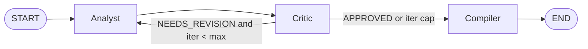

# Market Analyst (Course Project)

Реалізація ТЗ з [`project_market_analyst.md`](../project_market_analyst.md) для агро-домену.

Система має 3 ролі:
- **Analyst**: збирає дані з локального корпусу (RAG) і веб-пошуку.
- **Critic**: перевіряє якість, упередженість і фактологію.
- **Compiler**: формує фінальний структурований звіт і зберігає `.md`.

## Архітектура



## Що вже працює

- LangGraph loop Analyst ↔ Critic (до `max_analyst_critic_iterations`).
- Локальний RAG (`ingest.py` + FAISS/BM25 у `retriever.py`).
- Веб-пошук для валідації.
- Langfuse tracing (опційно, через `.env`).
- Збереження звіту в `output/`.

## Агро-контекст проєкту (для викладача)

Проєкт адаптовано під агро-аналітику, а саме під вибір гібридів кукурудзи.

- **Бізнес-запит**: допомогти агроному обирати гібриди на основі польових даних, а не загальних описів.
- **Дані**: локальний корпус PDF/MD + CSV з дослідних полів (роки 2024-2025, кілька локацій, різні густоти посіву).
- **Ключові метрики**: урожайність, вологість на збиранні, EBITDA, стабільність між локаціями.
- **Що реалізовано**:
  - RAG для документів (локальні матеріали + веб-перевірка),
  - CSV scoring (`rank_corn_hybrids`) для детермінованого ранжування,
  - multi-agent pipeline Analyst -> Critic -> Compiler з ревізіями,
  - monitoring через Langfuse та judge-тести.

## Швидкий старт

З каталогу `course-project/market-analyst`:

```bash
python -m venv .venv
.venv\Scripts\activate
pip install -r requirements.txt
copy .env.example .env
```

Заповніть у `.env` мінімум:
- `OPENAI_API_KEY`
- (опційно) `LANGFUSE_PUBLIC_KEY`, `LANGFUSE_SECRET_KEY`, `LANGFUSE_BASE_URL`

Далі:

```bash
python ingest.py
python .\main.py --topic "Агроринок України" --scope "зерно, логістика, маржа" --focus "експорт,добрива,погода"
```

Готовий звіт: `output/report_<session>_<timestamp>.md`.

## Langfuse

Перевірка ключів:

```bash
python verify_langfuse.py
```

Для скріншотів у здачу:
- список traces;
- один відкритий trace з кроками pipeline.

## Тести (LLM-as-a-Judge)

```bash
pytest tests/test_llm_judge.py -v --tb=short
```

Повний E2E-сценарій:

```bash
set RUN_MARKET_ANALYST_E2E=1
pytest tests/test_llm_judge.py -v -k e2e
```

## Структура

- `graph.py` — вузли графа і routing.
- `schemas.py`, `state.py` — контракти даних.
- `tools.py` — `knowledge_search`, `web_search`, `read_url`, `rank_corn_hybrids` (CSV scoring).
- `ingest.py`, `retriever.py` — індексація та retrieval.
- `main.py` — CLI-запуск.
- `tests/` — judge-тести.
- `corpus/` — ваші PDF/CSV/MD/TXT для RAG.
- `screenshots/` — артефакти з Langfuse/LangSmith.

## CSV по дослідних полях (кукурудза)

Для рекомендацій по гібридах система може використовувати детермінований scoring із CSV.
Покладіть файл у `corpus/` (або `corpus/reports/`) з колонками на кшталт:

- `Hybrid` / `Гібрид`
- `Year`
- `Village` або `Cluster_Village`
- `Урожайність`
- `Вологість`
- `EBITDA`

Після додавання CSV:

```bash
python ingest.py
python .\main.py --topic "Топ-10 гібридів кукурудзи" --scope "Україна, 2024-2025" --focus "урожайність,вологість,EBITDA,локації"
```
